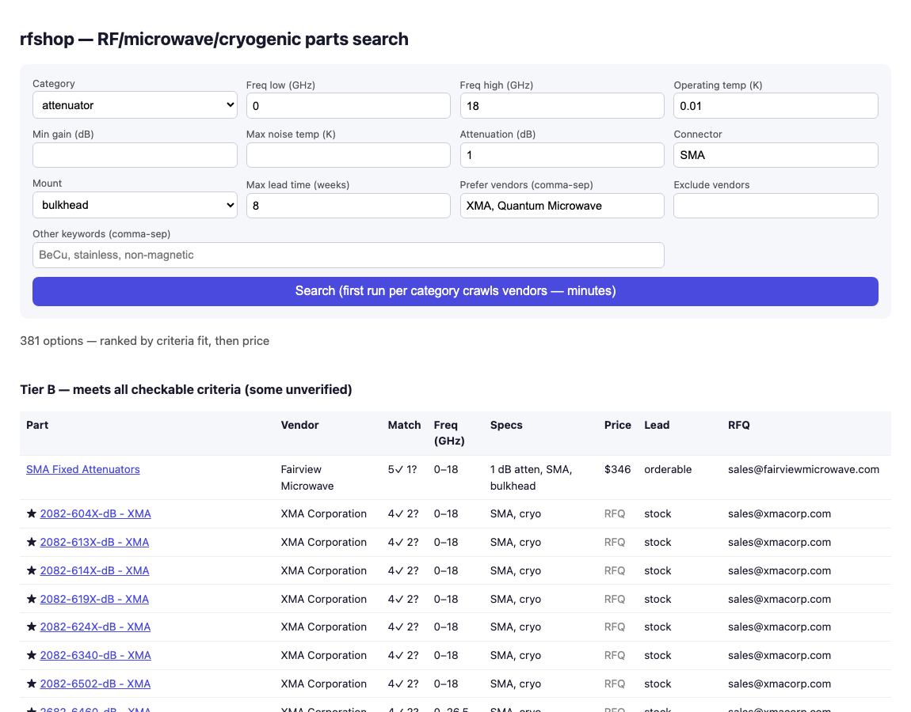

# rfshop — RF / microwave / cryogenic parts shopper

**Type in what part you need — get back every matching part from ~50 specialist vendors, ranked by how well it fits, how fast you can get it, and what it costs.**

rfshop deep-scrapes a curated registry of RF/microwave/cryogenic vendors (Low Noise Factory, XMA, Quantum Microwave, CryoCoax, Marki, Mini-Circuits, …), reads specs off product pages and PDF datasheets, and shows **every** option — near-misses included, clearly tiered, never silently hidden. It flags what's in stock vs. a 10-week custom build, and drafts quote-request emails for vendors that don't list prices.

Built for dilution-refrigerator / quantum-measurement work: cryogenic LNAs, attenuators, circulators, semi-rigid coax, hermetic feedthroughs, and the rest of the microwave chain.



---

## Installation (no terminal experience needed)

You'll type a few commands into a *terminal* — a window where you type text commands and press Enter.

**Open a terminal:**
- **Mac:** press `Cmd+Space`, type `Terminal`, press Enter.
- **Windows:** press the Windows key, type `PowerShell`, press Enter.
- **Linux:** you know where it is.

**1. Check you have Python 3.10+** — type this and press Enter:

```
python3 --version
```

If it prints `Python 3.10` or higher, continue. If it says "command not found" (or an older version), install Python from [python.org/downloads](https://www.python.org/downloads/) first (on Windows, tick **"Add Python to PATH"** during install, then use `python` instead of `python3` everywhere below).

**2. Download and install rfshop** — paste these one at a time, pressing Enter after each:

```
git clone https://github.com/KnowingIdea/rfshop
cd rfshop
pip3 install -e .
python3 -m rfshop setup
```

(No `git`? Mac will offer to install it automatically the first time; or click **Code → Download ZIP** on this page, unzip it, and in the terminal type `cd ` (with a space), drag the unzipped folder onto the terminal window, and press Enter — then continue with the `pip3` line.)

`setup` downloads a small headless browser (used to read vendor sites that require JavaScript) and checks which vendors are reachable. It prints one line per vendor — a few marked `backstop` or `BROKEN` is normal.

---

## Using the web interface

**Start it** (from the terminal, inside the rfshop folder):

```
python3 -m rfshop web
```

Leave that window open, then open **http://localhost:8760** in your normal browser. To stop the app later, click the terminal window and press `Ctrl+C`.

**Fill in only what you care about** — every field is optional except Category:

| Field | Example | Meaning |
|---|---|---|
| Category | `attenuator` | Part type (dropdown) |
| Freq low / high (GHz) | `0` / `18` | Band the part must cover |
| Operating temp (K) | `0.01` | `0.01` = 10 mK plate; `4` = 4 K stage; blank = room temp |
| Min gain / Max noise / Attenuation | `30` / `5` / `1` | Amplifier or attenuator numbers, in dB / K / dB |
| Connector / Mount | `SMA` / `bulkhead` | Connector type; bulkhead/feedthrough style |
| Max lead time (weeks) | `8` | Only well-ranked if obtainable this fast |
| Prefer / Exclude vendors | `XMA` | Preferred vendors get a ★ boost; excluded ones are hidden |
| Other keywords | `BeCu, non-magnetic` | Anything else that matters — these are matched too |

Click **Search**. The *first* search in a category crawls vendor catalogs and takes a few minutes; after that everything is cached for a week and searches take seconds.

**Reading the results** (see screenshot above):

- **Tiers:** A = meets every stated criterion · B = meets everything the page actually states (rest unverified) · C = misses one criterion · D = misses more. Within a tier: best fit first, then price.
- **Match** — `4✓ 2?` = 4 criteria confirmed met, 2 couldn't be verified from the page; `✗freq` names what failed.
- **Lead** — `stock` / `orderable` / `~6 wk` come from the product page; `~10 wk (vendor est)` is that vendor's *typical* lead time (an estimate); `custom` = made to order.
- **Price `RFQ`** — vendor doesn't list prices; email the address in the last column for a quote (mention the part number, quantity, and ask lead time).
- **★** — from your preferred-vendor list.

**Always confirm specs on the manufacturer's datasheet before ordering** — extraction is automated and vendors change their pages.

---

## Using with Claude Code (natural language, RFQ email drafts)

If you use [Claude Code](https://claude.com/claude-code), install rfshop as a plugin:

```
/plugin marketplace add KnowingIdea/rfshop
/plugin install rfshop@rfshop
```

Then just describe the part:

```
/find-part "cryogenic low-noise amplifier 4-8 GHz rated for 4 K, 30+ dB gain, need it within 6 weeks"
```

Claude parses the request, runs the same search engine, double-checks ambiguous extractions, covers bot-walled vendors (Digi-Key, Mini-Circuits, …) via web search, and drafts concise quote-request emails into `~/.rfshop/outbox/` for you to review and send. No API key needed — your Claude Code subscription does the language work.

---

## Command line (optional)

```
python3 -m rfshop search spec.json    # spec.json: {"category":"attenuator","freq_ghz":[0,18],"temp_k":0.01}
python3 -m rfshop doctor              # vendor registry health
python3 -m rfshop index --rebuild     # force re-crawl (normally automatic, 7-day cache)
python3 -m rfshop contact "XMA"       # RFQ email address for a vendor
python3 test_rfshop.py                # offline self-checks
```

Results are saved to `~/.rfshop/results.md`.

## Adding vendors

Create `~/.rfshop/vendors.yaml` (merged with the built-in registry by name):

```yaml
- name: Some Vendor
  url: https://vendor.com
  categories: [attenuator, termination]
  strategy: sitemap        # sitemap | search | backstop
  lead_weeks: 6            # typical lead time, weeks
  price_listed: false
  rfq_email: sales@vendor.com
```

## Troubleshooting

- **`pip3: command not found`** → try `python3 -m pip install -e .`
- **`rfshop: command not found`** → use `python3 -m rfshop ...` instead (always works).
- **First search is slow** → expected; it's crawling entire vendor catalogs once. Cached 7 days.
- **A vendor shows BROKEN in doctor** → its site blocks scraping or changed; the Claude plugin covers those via web search, or check the vendor site manually.
- Scraping is polite: per-domain rate limiting, robots-declared sitemaps only, no login walls.
